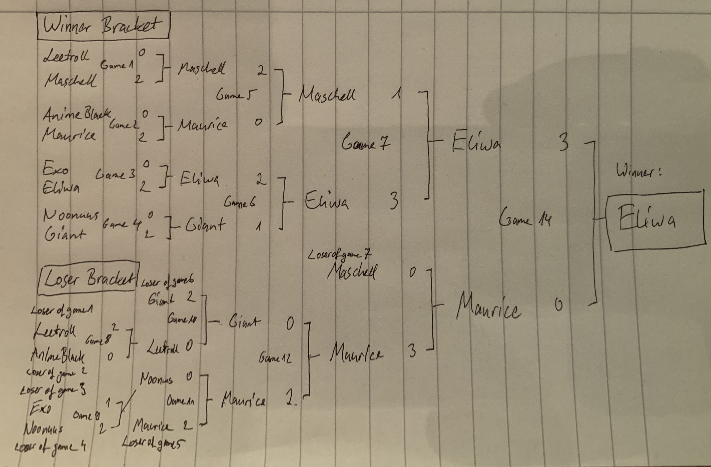
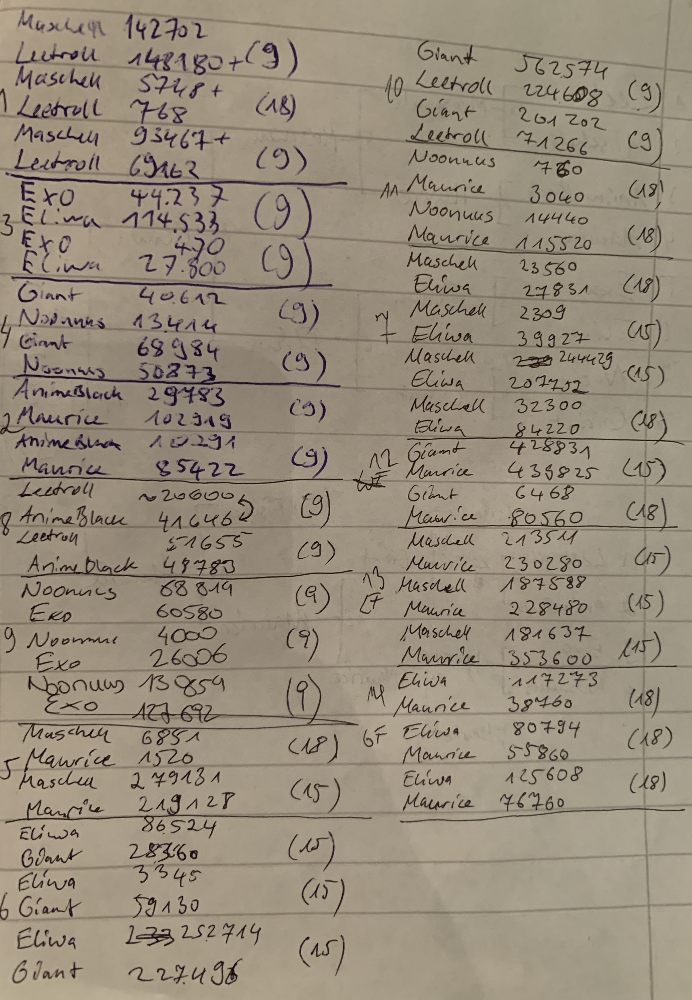
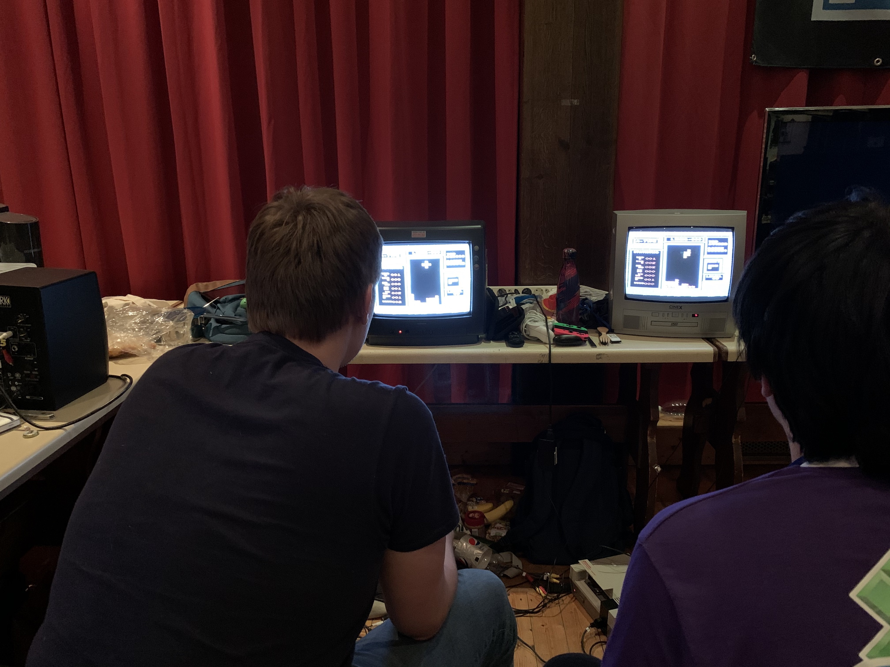

# United LAN 2019 - NES Tetris tournament

At the [United LAN 2019](http://united-lan.de), we conducted a small NES Tetris (PAL) turnament. There were eight total participants, four of which were seeded lower while four where seeded higher. The tournament took place in the night of 7 July to 8 July 2019.

Because we had some newer players in the tournament, we decided that the lower seeded player or the player that lost the previous game can choose the level. The minimum level was 9 (raised to 15 for winner's/loser's final and 18 for the grand final). The games were best of 3 and starting from winner's/loser's final best of 5.

Unfortunately, we weren't able to record the matches, but we noted down all the results including number of points (except for AnimeBlack's score in match 8 game 1 which we approximated). Next time we want to record the matches as well, maybe even stream the tournament if possible.

## Participants

### Higher Seed
- Maschell
- Maurice
- Eliwa
- Giant

### Lower Seed
- Leetroll
- AnimeBlack
- Exo
- Noonuus

## Bracket
I only have the bracket on a piece of paper:

## Rankings
1. Eliwa
2. Maurice
3. Maschell
4. Giant
5. Leetroll, Noonuus
6. \-
7. AnimeBlack, Exo
8. \-

## Organizers
- Eliwa - main organizer
- Exo (me) - documentation
- Maschell and Giant - consoles and TVs

We are all part of the PuyoPuyo Tetris Germany (PPTG, [Facebook](https://www.facebook.com/PPTGermany/), [Discord](https://discordapp.com/invite/Zwet4nf)) community.

## Pictures
**Raw Scores:**

**Setup:**

Next time we'll take more pictures as well!

## Data
I tried to put all the data into JSON files, but they don't conform to a specific existing format. If there is already an established data format for tournament results, please let me know!

### participants.json
Array of participant objects with `id`, `name`, and `seed` (`1` for higher seed, `-1` for lower seed).

### matches.json
Array of match objects:

- `id` - unique ID
- `gamesToWin` - number of games needed to win (`2` for best of 3, `3` for best of 5)
- `player1`/`player2` - object of `id` (player ID) and `fromMatch` (ID of   match that the player came from)
- `games` - array of game objects:
  - `level`- level the game was started at
  - `scores` - object with player IDs and their scores for the game
  - `winner` - player ID of the winner of the game
- `winner` - player ID of the winner of the match
- `loser` - player ID of the loser of the match

I also added a small script that checks the matches.json file for consistency. It can be run with `node check.js`.
